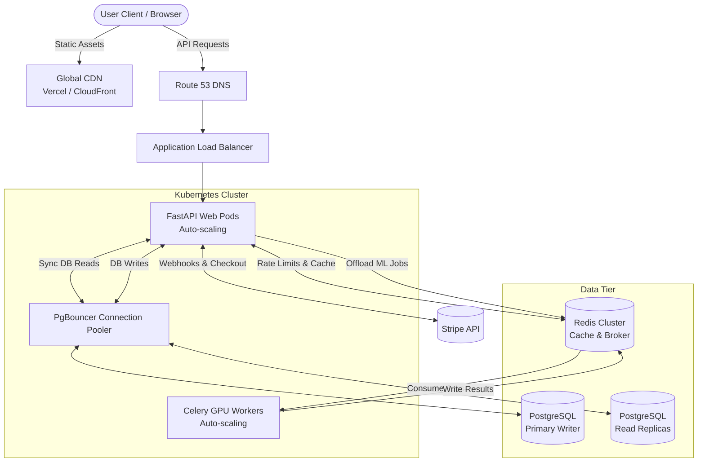

# 🚀 Sign0 Scaling & System Design Blueprint

This document outlines the deep system design and architectural blueprint required to scale the Sign0 application from a single-node prototype to a globally distributed, highly available, and low-latency system capable of handling millions of requests.

---

## High-Level System Architecture (Target State)

---

## 1. Request Flow & Asynchronous ML Processing
**The Problem:** Machine Learning inference (especially Transformers and Diffusion models) is highly CPU/GPU bound. If these run synchronously on the FastAPI event loop, the server will block, and concurrent users will experience massive latency or timeouts.

**The System Design Solution:**
We decouple the ingestion of the request from the actual processing using the **Worker Pattern**.
1. **Ingestion:** The FastAPI server receives the ASL keypoints and immediately stores them in a Redis Queue. It returns an HTTP 202 (Accepted) with a `task_id`.
2. **Processing:** Celery Workers (running on specialized GPU instances like AWS g4dn) pull jobs from the queue, run the ONNX models via `CUDAExecutionProvider`, and write the prediction back to Redis.
3. **Delivery:** The client uses a WebSocket connection (or HTTP polling) to receive the prediction as soon as the worker writes it to Redis.

*Trade-off:* We sacrifice architectural simplicity (introducing message brokers and workers) for massive improvements in horizontal scalability and isolation. If the ML models crash, the web servers stay up.

## 2. Database Scaling & Connection Pooling (PgBouncer)
**The Problem:** PostgreSQL creates a heavy OS process for every active connection. As we scale out our FastAPI pods horizontally using Kubernetes HPA (Horizontal Pod Autoscaler), each pod opens its own connection pool. 100 pods with 20 connections each = 2,000 connections, which will crash a standard Postgres instance.

**The System Design Solution:**
We introduce **PgBouncer**, a lightweight connection pooler.
- **Multiplexing:** PgBouncer sits between FastAPI and Postgres. FastAPI connects to PgBouncer, which holds thousands of lightweight connections, but PgBouncer multiplexes them onto a small pool of (e.g., 50) heavy, persistent Postgres connections.
- **CQRS / Read Replicas:** We route `SELECT` queries (e.g., loading user profiles or history) to Read Replicas, and `INSERT/UPDATE` queries (e.g., saving a Stripe payment) to the Primary Writer node.

## 3. Distributed Caching & Rate Limiting (Redis)
**The Problem:** Querying the database to check if a user has exceeded their "500 queries/day" limit on every single keystroke or API call creates immense latency and database load.

**The System Design Solution:**
We use a **Distributed Cache (Redis)**.
- **Token Bucket Algorithm:** We implement a Token Bucket algorithm in Redis for API rate limiting. Redis operates entirely in RAM, offering sub-millisecond response times.
- **Session Caching:** Instead of validating the JWT by checking the database for user status, we cache the decoded session state in Redis.
- **Idempotency & Memoization:** If two users send the exact same sequence of keypoints, the API will hash the input and check Redis. If a cached prediction exists, it returns it instantly, bypassing the ML workers entirely.

## 4. Availability & Partition Tolerance (CAP Theorem)
In the context of the CAP Theorem, this system leans towards **High Availability (AP)** for the prediction API, but strictly enforces **Consistency (CP)** for the billing and authentication systems.

- **Prediction API (AP):** If the PostgreSQL database goes down, the Redis cache and ML Workers can continue to serve predictions for authenticated users based on cached session data. We prioritize keeping the core ASL prediction feature online.
- **Billing API (CP):** When a webhook arrives from Stripe, or a user changes their password, we require strict consistency. If the Primary Database is unavailable, these requests will fail (return 503) rather than risking split-brain scenarios or data loss.

## 5. Security & Network Isolation (VPC)
As the system scales, security must be deeply integrated into the network topology.

**The System Design Solution:**
- **Public Subnets:** Only the Application Load Balancer (ALB) and NAT Gateways sit in the public subnet, exposed to the open internet.
- **Private Subnets:** FastAPI pods, Celery Workers, Redis, and PostgreSQL sit in private subnets with NO public IP addresses. They cannot be directly accessed from the internet.
- **Zero Trust:** Even inside the private subnet, the FastAPI pods must authenticate with PgBouncer using heavily rotated credentials, and the database encrypts all data at rest (AES-256).

## 6. Observability, Telemetry & Bottleneck Resolution
At scale, "it works on my machine" is irrelevant. You need deep telemetry.

**The System Design Solution:**
- **Distributed Tracing (OpenTelemetry):** Every incoming request is assigned a `trace_id`. This ID is passed from FastAPI -> Redis -> Celery. If a request is slow, we can view a waterfall graph to see exactly which component caused the delay.
- **Metrics (Prometheus/Grafana):** We track the "Four Golden Signals":
  1. **Latency:** Time taken to serve a prediction.
  2. **Traffic:** Number of predictions per second.
  3. **Errors:** Rate of HTTP 5xx errors.
  4. **Saturation:** CPU/GPU memory usage on the Celery workers and Postgres connection utilization.
